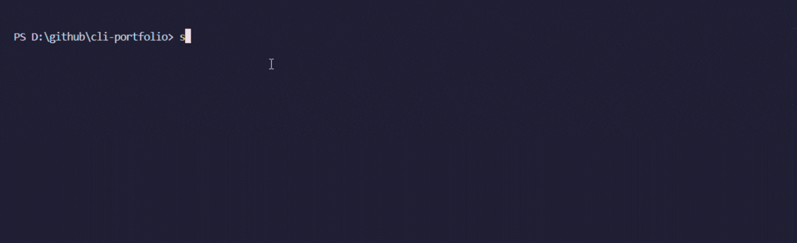

# Terminal Portfolio </>

<div align="center">



<p>Run <b><i>npx shwet46</i></b> to see this on terminal :)</p>

</div>

---

# Create Your Own Terminal Portfolio

Follow these steps to customize and deploy your own CLI portfolio.

---

## 1. Clone or Fork the Repository

You can either fork this repository or clone it locally.

```bash
git clone https://github.com/shwet46/CLI-portfolio.git
cd CLI-portfolio

npm i
```

---

## 2. Customize Your Portfolio Data

Update the `data.json` file with your personal information.

This file controls most of the displayed content.

modify `index.js` file accordingly based on the data.

---
## 3. Change CLI Command Name

Open `package.json` and update:

```json
"bin": {
	"your-command-name": "./index.js"
}
```

Example:

```json
"bin": {
	"shwet46": "./index.js"
}
```

---

## 4. Test Locally

Run the following command inside your project:

```bash
npm link
```

Then test:

```bash
your-command-name
```

---

## 5. Publish to NPM (if you want to)

If you want others to run your CLI portfolio globally:

### Login to npm

```bash
npm login
```

### Publish Package

```bash
npm publish
```

Users can then run:

```bash
npx your-command-name
```

---

#### hope so you liked this and created your own portfolio :)

## License

MIT License. See [LICENSE](LICENSE) file for details.
